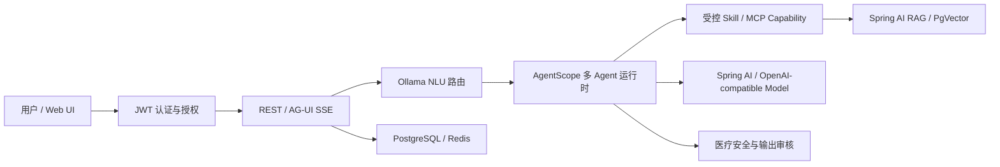

# MediX Java 医疗助手

MediX 是一个基于 Spring Boot、Spring AI 与 AgentScope Java 的多 Agent 医疗问答项目。系统提供健康咨询、症状风险分析、医学知识检索和循证研究能力，并通过明确的权限与医疗安全规则约束 Agent 和工具调用。

> 本项目用于医疗 AI 工程实践与演示。系统输出仅供学习和参考，不能替代专业医生的诊断和治疗；出现急症信号时请及时就医。

## 核心能力

- **AgentScope 运行时**：使用 `ReActAgent`、`Toolkit` 和结构化 Tool Calling 组织多个专业 Agent；保留 legacy 开关用于回滚。
- **Spring AI 集成**：统一接入 OpenAI-compatible Chat Model、Embedding 与 PgVector；支持以 DeepSeek 为 live provider。
- **Ollama 意图识别**：默认使用本地 `qwen2.5:1.5b` 进行低成本多标签路由；超时、低置信度或格式异常时安全回退。
- **AG-UI 与内置前端**：提供医疗问答界面和 AG-UI 风格 SSE 事件接口，展示路由、思考阶段、工具调用及最终答复。
- **认证与权限**：采用项目账户密码与 JWT，并实施用户 → Agent → Skill/MCP capability 的分层授权和审计。
- **医疗安全**：高危信号前置识别，限制不同 Agent 的工具边界，并在最终输出前执行风险提示、免责声明和表述修复。
- **数据与记忆**：使用 PostgreSQL、pgvector 和 Redis 支持业务数据、向量检索、会话记忆与共享上下文。
- **Windows 一键启动**：提供可双击运行的启动、停止脚本，支持离线演示与 DeepSeek live 模式。

## 架构概览



职责边界如下：

| 层 | 主要职责 |
| --- | --- |
| Spring Boot | HTTP API、认证授权、配置、持久化与监控 |
| Spring AI | 模型接入、Embedding、PgVector 和结构化输出 |
| AgentScope | ReAct、工具选择、Agent 路由与运行时状态 |
| MediX 业务层 | 医疗工具、安全规则、知识治理与审计 |

## 快速开始

### Windows 一键启动

进入 [`medix-java/windows-launcher`](./medix-java/windows-launcher)，双击：

```text
启动-MediX.bat
```

启动器会检查 Java 21、PostgreSQL、Redis、Ollama 和 8080 端口，并引导选择离线或 DeepSeek live 模式。停止服务时双击 `停止-MediX.bat`。

完整说明见 [Windows 启动器文档](./medix-java/windows-launcher/README-Windows.md)。

### Maven 启动

准备 Java 21、Maven 和 PostgreSQL；如需 PgVector，请先在目标数据库启用扩展：

```sql
create extension if not exists vector;
```

然后运行：

```bash
cd medix-java
mvn test
mvn spring-boot:run
```

服务默认地址为 [http://localhost:8080](http://localhost:8080)。默认 Agent 引擎为 AgentScope，Ollama NLU 默认启用；数据库、Redis、Ollama 和可选向量检索的详细配置请查看 [Java 项目说明](./medix-java/README.md)。

## DeepSeek live 配置

真实 API Key 只应通过当前启动进程的环境变量传入，不要提交到 Git、YAML、`.env`、脚本或日志中：

```text
MEDIX_LIVE_LLM=true
MEDIX_OPENAI_BASE_URL=https://api.deepseek.com
MEDIX_OPENAI_MODEL=deepseek-v4-flash
MEDIX_OPENAI_API_KEY=<your-api-key>
```

Ollama 小模型只负责意图分类；Worker Agent、工具后续轮次和最终合成由配置的 OpenAI-compatible provider 完成。不开启 live 模式时可使用离线链路进行本地演示与测试。

## 项目目录

```text
.
├── medix-java/                    # Spring Boot 主项目
│   ├── src/main/java/com/medix/   # Agent、工具、安全、RAG 与 API
│   ├── src/main/resources/        # 配置、约束与前端资源
│   ├── src/test/                  # 自动化测试
│   └── windows-launcher/          # Windows 启停脚本
└── docs/                          # PRD、迁移与交付记录
```

## 进一步阅读

- [完整运行、配置、API 与测试说明](./medix-java/README.md)
- [Windows 一键启动说明](./medix-java/windows-launcher/README-Windows.md)

## 安全说明

- 不要提交 API Key、JWT Secret、数据库密码或 Redis 密码。
- 生产环境必须替换所有开发用凭据，并使用足够强度的 JWT Secret 和账户密码。
- MCP 在当前项目中作为可注册、可授权的 capability 类型纳入权限模型；具体外部 MCP transport 是否可用，应以对应集成和端到端验证结果为准。
- 医疗安全边界由业务规则和中间件强制执行，不交由模型自行决定。
