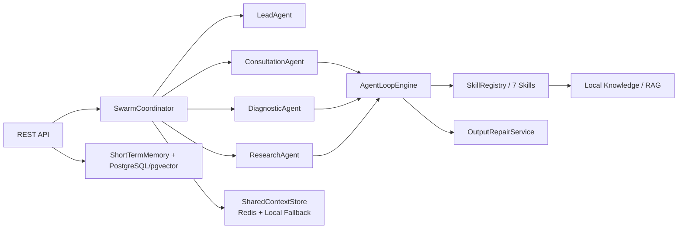

# MediX Java 医疗助手 Agent 系统

这是一个 Java/Spring Boot 版本的多 Agent 医疗问答项目，主项目位于 [`medix-java`](./medix-java)。

项目基于 Spring AI 2.0、spring-ai-agent-utils 与 LangChain4j 构建，通过 Skills-Agent 解耦、ReAct 工具调用循环和 Agent Swarm 协作机制，支持健康咨询、症状诊断、医学研究等医疗问答场景。

> 本项目用于医疗问答系统工程实践演示，输出内容仅供学习和参考，不能替代专业医生诊断。

## 核心亮点

- **7 个原子 Skills**：知识检索、风险评估、症状分析、生活方式建议、ICD-10 编码、临床指南、深度研究。
- **3 个专业 Agent**：健康咨询、症状诊断、医学研究，统一接入自研 `AgentLoopEngine`。
- **ReAct 工具调用循环**：支持 LLM 自主选择 Skill、观察工具结果并继续推理，内置迭代次数和工具调用次数限制。
- **Agent Swarm 协作**：复杂/高危/循证类问题由 `LeadAgent` 拆解任务，`SwarmCoordinator` 并行调度多个 Agent 后汇总结果。
- **短期/长期记忆**：短期记忆维护多轮上下文，长期记忆基于 PostgreSQL + pgvector 支持相似案例召回。
- **Harness 与输出修复**：通过 YAML 约束 Agent 能力边界，并自动补全免责声明、高危症状提醒和修正绝对化诊断表述。

## 架构概览



## 快速开始

```bash
cd medix-java
mvn test
```

启动完整服务前，需要准备 PostgreSQL 并启用 pgvector：

```sql
create extension if not exists vector;
```

启动服务：

```bash
mvn spring-boot:run
```

默认 `MEDIX_LIVE_LLM=false`，系统使用本地 `FakeModelGateway`，不需要大模型 API Key 也可以运行测试和本地演示。

## 真实 LLM 配置

如需接入 OpenAI-compatible 模型服务：

```bash
MEDIX_LIVE_LLM=true
MEDIX_OPENAI_API_KEY=your-key
MEDIX_OPENAI_BASE_URL=https://api.example.com
MEDIX_OPENAI_MODEL=your-model
```

## API 示例

```bash
curl -X POST http://localhost:8080/api/v1/chat \
  -H "Content-Type: application/json" \
  -d '{
    "sessionId": "demo-1",
    "question": "52岁男性，高血压多年，今天出现胸痛和呼吸困难，想了解可能风险、临床指南证据以及下一步应该怎么办。",
    "context": {
      "age": 52,
      "sex": "male"
    }
  }'
```

更多运行说明、环境变量、API 和测试覆盖请查看 [`medix-java/README.md`](./medix-java/README.md)。
