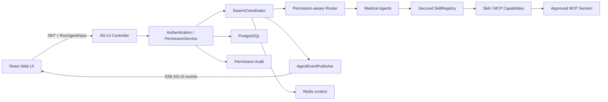

# MediX 前端、AG-UI 与三层权限体系 PRD

> 状态：v0.2，MCP 与认证方案已确认，可进入实现评审  
> 日期：2026-07-14  
> 范围：`medix-java` 现有 Spring Boot 医疗助手及新增 Web 前端

## 1. 背景与现状

MediX 已具备聊天 API、多 Agent 调度、7 个 Skills、短期/长期记忆、共享上下文、Harness Agent-Skill 边界及 PostgreSQL/Redis 基础设施，但当前存在以下缺口：

1. 没有用户可操作的前端界面，只能通过 API 调试。
2. `/api/v1/chat` 是一次性 JSON 响应，无法向界面实时展示运行、Agent、Skill 和最终回答状态。
3. 没有身份认证、用户模型和用户级授权；现有 Harness 只约束固定的 Agent-Skill 映射。
4. 用户、Agent、Skill/MCP 之间缺少统一、可持久化、可审计的权限关系。
5. 设计、编码和验收三个模型角色尚无隔离的 Prompt、上下文记忆和交接机制。

AG-UI 是面向 Agent 与用户界面的开放事件协议，支持流式消息、状态同步、工具调用和人机协作。官方资料说明其后端接收兼容输入并通过 SSE、WebSocket 等传输标准事件；本项目首期采用 HTTP POST + SSE。参考：[AG-UI 官方仓库](https://github.com/ag-ui-protocol/ag-ui)、[AG-UI 官方文档](https://docs.ag-ui.com/)、[@ag-ui/core](https://www.npmjs.com/package/@ag-ui/core)。

## 2. 产品目标

### 2.1 核心目标

1. 提供可直接使用的中文医疗助手 Web 前端。
2. 用 AG-UI 标准输入和事件流连接前端与现有 Swarm/Agent 后端。
3. 建立 `用户 -> Agent -> Skill/MCP` 三层、默认拒绝、可审计的权限体系。
4. 保留现有 `/api/v1/chat` 的兼容性，避免破坏已有测试和调用方。
5. 让设计、执行、验收三个模型角色使用独立 Prompt 和独立上下文，以文件化交接物协作。

### 2.2 成功指标

- 用户可在浏览器完成登录、发起问诊、观看流式状态、查看最终答案。
- AG-UI 端点的核心输入与事件可通过 `@ag-ui/core` Schema 校验。
- 任意请求必须同时通过用户-Agent授权与Agent-能力授权；越权请求为可解释拒绝，且不触发能力执行。
- 所有授权变更与拒绝均可审计。
- 原有 Maven 测试全部通过，新增后端、前端和端到端测试通过。

## 3. 术语与关键假设

### 3.1 三层定义

| 层级 | 本 PRD 定义 | 例子 |
| --- | --- | --- |
| 用户层 | 已认证的系统使用者及其角色 | 普通用户、医生、管理员 |
| Agent 层 | 可被用户选择或由路由器调度的医疗 Agent | consultation、diagnostic、research |
| Skill/MCP 层 | Agent 可调用的原子能力资源 | assess_risk、deep_research、MCP Tool/Resource |

### 3.2 MCP 定义（已确认）

产品已确认原需求中的 `CMP` 是 `MCP`。本项目将 Skill 与 MCP 暴露的能力统一抽象为 `Capability`：本地 Java 能力类型为 `SKILL`，MCP Server 暴露的工具和资源分别为 `MCP_TOOL` 与 `MCP_RESOURCE`。每项 MCP 能力必须关联已登记的 MCP Server，经过发现、启用和授权后才能对 Agent 可见或被调用。

首期只允许管理员登记的 MCP Server，不接受用户在聊天请求中动态传入任意 Server 地址。MCP 调用必须经过统一网关、超时、参数校验、出站地址白名单和审计，模型输出或 AG-UI 请求体不能直接授予 MCP 权限。

### 3.3 版本基线

- Java 21、Spring Boot 4.1、PostgreSQL/pgvector、Redis。
- 前端拟采用 React + TypeScript + Vite。
- AG-UI 契约以实现时锁定的 `@ag-ui/core` 版本为准；PRD 编制时 npm 稳定包为 `0.0.57`。
- 意图识别小模型保持默认关闭，继续由本地高危规则和 LeadAgent 路径工作。

## 4. 用户角色与用例

### 4.1 普通用户

- 登录并查看本人资料。
- 新建或继续医疗咨询线程。
- 只使用管理员授予的 Agent。
- 实时查看回答、参与 Agent、能力调用状态和医疗免责声明。
- 查看自己的历史会话，不可查看他人会话。

### 4.2 医疗专业用户

- 拥有普通用户能力。
- 可被授予 diagnostic/research 等更高风险 Agent。
- 可查看更完整的证据、指南和能力调用轨迹。

### 4.3 管理员

- 管理用户状态与角色。
- 配置用户-Agent授权。
- 配置Agent-Skill/MCP授权。
- 查看权限矩阵、拒绝原因、授权变更和运行审计。
- 不允许通过界面删除系统最后一个管理员。

## 5. 范围

### 5.1 本期包含

- 登录、当前用户、退出登录。
- 医疗问答主界面、会话列表、Agent运行轨迹、能力调用状态。
- 权限管理界面和审计列表。
- AG-UI HTTP + SSE 端点及前端客户端。
- MCP Server目录、Tool/Resource发现及受权限控制的调用网关。
- 用户-Agent和Agent-Capability两道运行时授权。
- Spring Security、密码哈希、数据库迁移、初始管理员。
- 三角色独立 Prompt、记忆目录和交接清单。
- 单元、集成、契约、前端和端到端测试。

### 5.2 本期不包含

- 第三方 OAuth/OIDC、短信验证码和找回密码。
- 医院 HIS/EMR 对接。
- 多租户组织模型。
- 真正的处方、诊断或医疗支付。
- 完整 AG-UI 所有可选事件；首期只实现项目实际需要的核心事件集。
- 意图识别小模型上线。

## 6. 设计思路

### 6.1 总体原则

1. **协议适配与业务核心分离**：AG-UI Controller 只负责输入校验、事件映射和传输，现有 SwarmCoordinator 仍是业务执行核心。
2. **默认拒绝、逐层收窄**：用户可见 Agent 集合与每个 Agent 可见能力集合都由权限服务计算；未知主体、未知资源或缺少授权一律拒绝。
3. **入口与执行点双重校验**：Controller 先校验用户可访问的 Agent；Coordinator/SkillRegistry 在真正调度与调用前再次校验，避免绕过 API。
4. **权限影响路由而非只影响展示**：未授权 Agent 不进入路由候选集；路由后若无可用 Agent，返回明确的权限错误，不静默提升权限。
5. **事件可观察、医疗输出安全**：Agent/Skill 执行映射为 AG-UI 事件，最终文本仍经过现有 OutputRepairService。
6. **渐进兼容**：保留旧 Chat API；前端和新客户端使用 AG-UI 端点。

### 6.2 目标架构



### 6.3 后端模块划分

- `security`：认证过滤器、JWT服务、安全配置、当前用户上下文。
- `identity`：用户、角色、用户仓储与管理接口。
- `permission`：Capability、授权关系、PermissionService、拒绝原因和审计。
- `agui`：RunAgentInput DTO、事件 DTO、SSE 编码、Controller、运行生命周期。
- `agent/swarm/skill`：通过最小改动接入权限上下文与事件发布器。
- `frontend`：独立 Vite 工程，生产构建可复制到 Spring Boot 静态资源或独立部署。

## 7. AG-UI 协议设计

### 7.1 端点

`POST /api/v1/agui`

- 请求头：`Authorization: Bearer <token>`、`Content-Type: application/json`、`Accept: text/event-stream`。
- 请求体：AG-UI `RunAgentInput`，至少包含 `threadId`、`runId`、`state`、`messages`、`tools`、`context`、`forwardedProps`；可选字段按锁定版本处理。
- 响应：`text/event-stream;charset=UTF-8`；每个 `data:` 为单个 AG-UI JSON 事件。
- 线程所有权：`threadId` 必须属于当前用户，否则返回 403。
- 幂等：同一用户的重复 `runId` 不重复执行；进行中返回已有事件流，完成后可读取结果。

### 7.2 首期事件集

| 阶段 | AG-UI 事件 | MediX 含义 |
| --- | --- | --- |
| 开始 | `RUN_STARTED` | 建立 thread/run，记录当前用户 |
| Agent步骤 | `STEP_STARTED` / `STEP_FINISHED` | Lead/consultation/diagnostic/research 开始与结束 |
| 能力调用 | `TOOL_CALL_START` / `TOOL_CALL_ARGS` / `TOOL_CALL_END` / `TOOL_CALL_RESULT` | Skill/MCP调用及结果摘要 |
| 状态 | `STATE_SNAPSHOT` 或 `STATE_DELTA` | 路由、参与Agent、权限裁剪、运行状态 |
| 文本 | `TEXT_MESSAGE_START` / `TEXT_MESSAGE_CONTENT` / `TEXT_MESSAGE_END` | 助手最终回答的流式片段 |
| 完成 | `RUN_FINISHED` | 成功完成并包含结果摘要 |
| 失败 | `RUN_ERROR` | 鉴权外的运行错误；不泄露内部堆栈 |

前端必须忽略未知事件，保证协议向前兼容。权限拒绝在尚未建立 SSE 时使用 HTTP 401/403；运行中能力被拒绝时发 `RUN_ERROR`，并写审计记录。

### 7.3 事件发布实现

- 新增 `AgentEventPublisher` 接口和按 run 隔离的 EventSink。
- SwarmCoordinator 在路由、Agent开始/结束时发布生命周期事件。
- AgentLoopEngine 在 Skill 调用前后发布 Tool Call 事件。
- 首期模型如果只返回完整文本，由服务端按 Unicode code point 安全切片生成 `TEXT_MESSAGE_CONTENT`；未来接入真实 token stream 时替换生产者，不改协议。
- SSE 断开时取消订阅并设置最大运行时间；是否取消后端任务由配置控制，默认继续完成并持久化结果。

### 7.4 旧接口兼容

- `/api/v1/chat` 保留，内部复用同一个 ChatApplicationService。
- 旧接口同样必须认证和执行权限校验；开发/测试 profile 可提供显式配置的 demo 身份，不允许生产环境匿名回退。

## 8. 三层权限体系

### 8.1 权限链

一次能力调用必须同时满足：

```text
用户已启用
AND 用户拥有目标 Agent 的 USE 权限
AND Agent 拥有目标 Capability 的 EXECUTE 权限
AND Capability 已启用
AND 请求未命中医疗安全禁令
```

任何条件失败均拒绝。管理员权限用于“管理授权”，不自动绕过医疗安全约束；管理员若要运行 Agent，也必须拥有相应 USE 授权。

### 8.2 权限模型

- 用户角色：`USER`、`CLINICIAN`、`ADMIN`，用于管理端/API 粗粒度访问。
- `user_agent_grants`：用户到 Agent 的显式授权，动作首期为 `USE`。
- `agent_capability_grants`：Agent 到 Skill/MCP Tool/Resource 的显式授权；Skill与Tool首期动作为 `EXECUTE`，Resource首期动作为 `READ`。
- Harness YAML 迁移为系统初始化数据和安全上限；数据库授权只能在该上限内收窄，不能通过 UI 扩大到被代码/安全策略禁止的能力。
- PermissionService 返回结构化决定：`allowed`、`reasonCode`、`userId`、`agentId`、`capabilityId`。

### 8.3 路由规则

1. 获取当前用户允许的 Agent 集合。
2. 本地高危规则命中时优先需要 diagnostic + consultation；缺少 diagnostic 权限时不得伪装成诊断，应返回“权限不足且建议立即线下就医”的安全响应并审计。
3. NLU关闭时 LeadAgent 只能把任务分配到允许集合；禁止输出的 Agent 分配被过滤并重新规划一次。
4. 重新规划后无可用 Agent，返回 `NO_AUTHORIZED_AGENT`。
5. Skill 元数据在进入 Prompt 前按Agent-Capability授权过滤；即使模型手工输出未授权 Skill 名，也由执行点拒绝。

### 8.4 审计

记录以下事件：登录成功/失败、授权新增/撤销、权限拒绝、Agent运行、Capability调用。审计字段至少包含 actor、subject、action、resource、decision、reason、runId、threadId、IP、时间；医疗问题正文和完整模型输出默认不写权限审计，避免敏感信息扩散。

## 9. 数据模型

建议新增 Flyway `V2__identity_permissions_agui.sql`：

| 表 | 关键字段 |
| --- | --- |
| `app_users` | id(UUID), username(unique), password_hash, display_name, status, created_at, updated_at |
| `user_roles` | user_id, role |
| `agent_definitions` | id(varchar), display_name, description, enabled, risk_level |
| `mcp_servers` | id(UUID), name, transport, endpoint, enabled, config_ref, created_at；endpoint仅允许管理员配置 |
| `capabilities` | id(varchar), type(SKILL/MCP_TOOL/MCP_RESOURCE), mcp_server_id(nullable), display_name, enabled, metadata(jsonb) |
| `user_agent_grants` | user_id, agent_id, action, granted_by, created_at；唯一(user,agent,action) |
| `agent_capability_grants` | agent_id, capability_id, action, granted_by, created_at；唯一(agent,capability,action) |
| `conversation_threads` | id, owner_user_id, title, created_at, updated_at |
| `agent_runs` | run_id, thread_id, user_id, status, started_at, finished_at, result(jsonb) |
| `permission_audit_logs` | id, actor_user_id, action, subject_type/id, resource_type/id, decision, reason, run_id, created_at |

初始数据：3 个 Worker Agent、7 个现有 Skills、与当前 Harness 一致的 Agent-Capability授权。初始管理员通过环境变量创建；若生产环境没有设置初始密码则拒绝启动，禁止硬编码默认生产密码。

## 10. API 设计

### 10.1 认证与当前用户

- `POST /api/v1/auth/login`
- `GET /api/v1/auth/me`
- `POST /api/v1/auth/logout`（若使用短期JWT + refresh token，则撤销refresh token）

### 10.2 用户可用资源

- `GET /api/v1/me/agents`
- `GET /api/v1/me/threads`
- `GET /api/v1/me/threads/{threadId}`
- `POST /api/v1/agui`

### 10.3 管理端

- `GET/POST/PATCH /api/v1/admin/users`
- `GET /api/v1/admin/permissions/matrix`
- `PUT/DELETE /api/v1/admin/users/{userId}/agents/{agentId}`
- `PUT/DELETE /api/v1/admin/agents/{agentId}/capabilities/{capabilityId}`
- `GET/POST/PATCH /api/v1/admin/mcp-servers`
- `POST /api/v1/admin/mcp-servers/{serverId}/sync`
- `GET /api/v1/admin/audit`

所有错误使用稳定的 `code`、用户可读 `message` 和 `traceId`；不把异常类名、SQL或堆栈返回给前端。

## 11. 前端界面

### 11.1 视觉方向

- 中文医疗工作台风格：清晰、克制、高对比，避免过度“AI霓虹”。
- 桌面端三栏布局，移动端折叠为抽屉与底部操作区。
- 高危提示、权限拒绝、普通信息使用不同语义色，并始终配文字/图标，不能只靠颜色。

### 11.2 页面与组件

1. **登录页**：账号、密码、错误提示、隐私与医疗免责声明。
2. **问诊工作台**：
   - 左侧：会话列表、新建问诊、搜索。
   - 中间：消息流、建议问题、输入框、停止/重试。
   - 右侧：本次路由、参与Agent、Skill/MCP调用时间线、权限裁剪说明。
3. **我的能力**：展示当前用户可用Agent及每个Agent可用能力，只读。
4. **权限管理**（管理员）：用户-Agent矩阵、Agent-Capability矩阵，授权/撤销二次确认。
5. **MCP 管理**（管理员）：登记受信 Server、同步 Tool/Resource、启停能力、查看健康与最近调用状态。
6. **审计与系统状态**（管理员）：筛选拒绝、变更、运行事件；查看 PostgreSQL、Redis、LLM、NLU、MCP 状态。

### 11.3 AG-UI 前端状态

- 按 `threadId + runId` 隔离事件。
- 事件 reducer 维护 messages、steps、toolCalls、sharedState、runStatus 和 error。
- 页面刷新后从线程/运行接口恢复；SSE重连不重复追加已消费事件。
- 未知事件忽略并记录开发日志；事件乱序或缺失结束事件时进入可恢复错误态。

### 11.4 可访问性与安全展示

- 键盘可完成全部聊天和管理操作，焦点可见。
- 表单与状态满足 WCAG 2.1 AA 基本要求。
- Markdown 默认禁用原始 HTML并进行 URL 安全过滤，防止 XSS。
- 不在 localStorage 保存长期敏感令牌；优先使用 HttpOnly Secure SameSite Cookie，开发环境可配置例外。

## 12. 三模型独立上下文与 Prompt

### 12.1 角色隔离

| 阶段 | 用户指定角色 | 独立输入 | 允许输出 | 禁止事项 |
| --- | --- | --- | --- | --- |
| 设计 | 5.6Sol 中度推理 | 需求、代码只读快照、官方规范 | PRD、ADR、接口契约 | 修改业务代码 |
| 执行 | 5.6Terra | 已批准PRD、ADR、执行Prompt、干净/已知工作树 | 代码、迁移、测试、实现清单 | 读取设计对话记忆、降低验收标准 |
| 验收 | 5.6Sol 高度推理 | 已批准PRD、代码diff、测试证据、验收Prompt | 验收报告、缺陷清单 | 修改实现、读取执行对话记忆 |

当前 Codex 运行环境不能保证按名称选择上述具体模型版本，因此工程层面必须通过“独立代理上下文 + 独立 Prompt + 文件化交接”实现职责隔离；实际模型路由由可用平台配置完成。

### 12.2 文件与记忆隔离

拟新增：

```text
docs/delivery/
├── prompts/design.prompt.md
├── prompts/execution.prompt.md
├── prompts/acceptance.prompt.md
├── handoffs/design-manifest.json
├── handoffs/execution-manifest.json
└── reports/acceptance-report.md
```

- 每个阶段启动新上下文，不继承上一阶段聊天历史。
- 只通过版本化产物交接；manifest 记录输入文件、Git commit、SHA-256和时间。
- 设计记忆只保存到 design 命名空间，执行与验收不可读；执行、验收同理。
- 若在产品内持久化交付记忆，Redis key 使用 `medix:delivery:{phase}:{runId}`，PostgreSQL记录 `phase` 并由权限策略隔离。
- 验收失败只能输出缺陷和证据，由新的执行上下文修复，再启动新的验收上下文。

### 12.3 独立 Prompt 核心约束

- 设计 Prompt：以需求完整性、协议正确性、威胁模型和可验收性为目标，只读代码。
- 执行 Prompt：逐条追踪 PRD/ADR，保护现有改动，先测试后实现，禁止自行修改验收标准。
- 验收 Prompt：默认不信任实现声明，按标准复测，关注越权、对象级授权、协议顺序、错误路径和回归。

## 13. 非功能要求

- 安全：密码使用 BCrypt/Argon2；生产JWT密钥不得使用默认值；所有对象级访问校验 owner/user grant。
- 性能：首个 `RUN_STARTED` 事件在请求接受后 500ms 内发送（不含网络）；权限判定 P95 < 50ms；普通本地 Fake LLM 问答 P95 < 5s。
- 可用性：Redis不可用时聊天共享状态降级到本地，但授权必须以 PostgreSQL/受控缓存为准，禁止“缓存异常即允许”。
- 一致性：授权撤销后本机 5 秒内生效；高风险授权变更主动失效缓存。
- 可观测：runId/traceId贯穿日志、SSE事件和审计；指标不包含问题正文。
- 隐私：日志与审计最小化收集医疗文本；会话仅本人和明确授权管理员可见。

## 14. 验收标准

以下条目全部通过才可验收；P0任一失败即整体不通过。

### 14.1 前端（P0）

- [ ] 用户可登录并看到本人显示名和可用Agent，错误密码不泄露账号是否存在。
- [ ] 用户可新建会话、发送中文问题并看到流式回答；刷新后能恢复该用户历史会话。
- [ ] 页面展示运行状态、参与Agent和至少一次实际Skill调用轨迹；无调用时明确显示“本次未调用能力”。
- [ ] 管理员可在两张矩阵中授权/撤销用户-Agent及Agent-Capability，刷新后状态保持。
- [ ] 普通用户不能访问管理路由或调用管理API。
- [ ] 375px与1440px视口无关键内容溢出；键盘可完成登录和发送消息。

### 14.2 AG-UI（P0）

- [ ] `POST /api/v1/agui` 接受锁定版本的有效 `RunAgentInput`，无效输入返回400及稳定错误码。
- [ ] 正常运行事件顺序至少为 `RUN_STARTED -> TEXT_MESSAGE_START -> TEXT_MESSAGE_CONTENT+ -> TEXT_MESSAGE_END -> RUN_FINISHED`。
- [ ] Agent与Skill执行分别产生Step和Tool Call事件，ID在开始/内容/结束事件间一致。
- [ ] SSE事件可由锁定版本 `@ag-ui/core` Schema解析；契约测试在CI运行。
- [ ] 客户端断线、运行异常和超时不会产生伪造的成功完成事件，并能看到可恢复错误。
- [ ] 重复runId不造成重复Agent/Skill执行。

### 14.3 权限（P0）

- [ ] 无登录凭证访问聊天、AG-UI、个人与管理接口返回401。
- [ ] 用户无Agent授权时请求返回403/业务拒绝，目标Agent未运行、其Skill未调用。
- [ ] Agent无Capability授权时，即使模型输出该Skill调用，也在执行点被拒绝且产生审计。
- [ ] 用户A不能读取、继续或猜测访问用户B的threadId/runId。
- [ ] 前端隐藏资源不能替代后端校验；直接构造HTTP请求仍被拒绝。
- [ ] 未知用户、Agent、Capability及授权存储异常均默认拒绝。
- [ ] 聊天请求不能动态指定MCP Server地址；未登记、未启用或未授权的MCP Tool/Resource在调用前被拒绝并产生审计。
- [ ] MCP网关拒绝指向环回、链路本地、云元数据地址或不在白名单内的出站目标，且响应中不泄露连接凭据。
- [ ] 撤销授权后5秒内生效；已有页面重新调用时被拒绝。
- [ ] 现有 Harness 禁令不能被数据库授权或管理员角色放宽。
- [ ] 高危问题在缺少diagnostic权限时返回明确安全提示，不进行未授权诊断调用。

### 14.4 数据与审计（P0）

- [ ] Flyway可从V1升级到新版本，并可在空数据库一次性初始化。
- [ ] 密码库中不存在明文密码；日志、SSE错误和审计不包含密码/JWT/完整堆栈。
- [ ] 授权新增、撤销、拒绝都记录actor、resource、decision、reason和时间。
- [ ] PostgreSQL重启后用户、授权、线程仍存在；Redis重启不导致授权放大。

### 14.5 三角色隔离与工程质量（P0）

- [ ] 三份 Prompt 文件内容独立，角色权限和输入输出边界明确。
- [ ] 设计、执行、验收分别由新上下文运行，只通过manifest所列文件交接。
- [ ] 验收报告包含每条验收标准的 PASS/FAIL、命令或截图证据及Git commit。
- [ ] `mvn test`、前端单元测试、前端构建、AG-UI契约测试和关键E2E全部通过。
- [ ] 原 `/api/v1/chat` 和 `/api/v1/skills` 既有功能无回归，原测试全部通过。

### 14.6 P1 验收

- [ ] Lighthouse Accessibility >= 90（登录和问诊主页面）。
- [ ] 权限判定P95 < 50ms，首事件P95 < 500ms。
- [ ] 审计筛选支持时间、用户、decision、resource type。
- [ ] 前端未知AG-UI事件不会导致页面崩溃。

## 15. 测试策略

- 后端单元测试：PermissionService决策表、路由裁剪、Skill执行点拒绝、事件映射。
- 后端集成测试：Spring Security、JWT、对象级权限、Flyway、PostgreSQL、Redis降级。
- 契约测试：把SSE事件逐个交给`@ag-ui/core`验证，并验证事件生命周期。
- 前端测试：事件reducer、权限守卫、错误与重连、XSS内容。
- E2E：普通用户成功问答、越权Agent、越权线程、管理员授权后生效、撤销后失效。
- 安全测试：IDOR、伪造Agent ID、伪造Skill名、重复runId、失效token、管理员接口越权。

## 16. 实施阶段与交付物

1. **阶段A：契约与安全骨架**  
   数据迁移、用户/授权域、Spring Security、PermissionService、AG-UI DTO与契约测试。
2. **阶段B：运行链路**  
   权限感知路由、Skill执行点校验、事件发布、SSE端点、旧API复用。
3. **阶段C：前端**  
   登录、问诊工作台、AG-UI reducer、Agent轨迹、管理矩阵、审计。
4. **阶段D：加固与验收**  
   E2E、安全测试、性能与无障碍检查、文档、独立验收报告。

## 17. 风险与对策

| 风险 | 影响 | 对策 |
| --- | --- | --- |
| MCP Server 被用作任意出网通道 | SSRF、数据泄露 | 仅管理员登记、地址白名单、统一网关、参数校验、超时与审计 |
| AG-UI 0.x协议变化 | 客户端/服务端不兼容 | 锁定版本、契约测试、协议适配层、忽略未知事件 |
| 现有执行仅返回完整文本 | 流式体验不真实 | 首期事件化切片；预留ModelGateway token事件接口 |
| 路由绕过用户授权 | 严重越权 | 入口、路由、执行点三处校验；IDOR/E2E测试 |
| Redis故障引发错误授权 | 权限扩大 | 授权以PostgreSQL为准；缓存异常默认拒绝 |
| 医疗数据进入日志/审计 | 隐私风险 | 最小化字段、脱敏、禁止正文进入权限审计 |
| 初始管理员默认密码 | 账号接管 | 环境变量一次性引导，生产缺失即拒绝启动 |

## 18. 已确认的实现决策

以下两项已由产品确认：

1. 原需求中的 `CMP` 是 `MCP`；第三层能力类型采用 `SKILL`、`MCP_TOOL`、`MCP_RESOURCE`。
2. 首期认证采用项目内账号密码 + JWT，并通过 HttpOnly、SameSite Cookie 传递；生产环境启用 Secure。暂不接企业 SSO。
