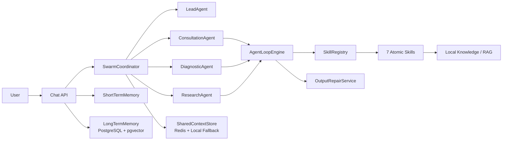

# MediX Java 医疗助手 Agent 系统

MediX Java 是一个基于 Spring Boot 的多 Agent 医疗问答平台，围绕健康咨询、症状诊断和医学研究三个专业 Agent，提供 ReAct 工具调用循环、Swarm 协作路由、短期/长期记忆、RAG 检索和医疗输出修复能力。

> 本项目用于医疗问答系统工程实践演示，输出内容仅供学习和参考，不能替代专业医生诊断。

## 技术栈

- Java 21
- Spring Boot 4.1.0
- Spring AI 2.0 OpenAI-compatible Chat Client
- spring-ai-agent-utils 0.10.0
- LangChain4j 1.16.3
- PostgreSQL + pgvector
- Redis
- Maven

## 核心能力

- **Skills-Agent 解耦**：实现知识检索、风险评估、症状分析、生活方式建议、ICD-10 编码、临床指南、深度研究 7 个原子 Skills，并通过 `SkillRegistry` 统一注册执行。
- **多 Agent 协作**：实现健康咨询、症状诊断、医学研究 3 个 Worker Agent，以及负责任务拆解和汇总的 `LeadAgent`。
- **ReAct Agent Loop**：自研 `AgentLoopEngine` 支持 `Think -> Act -> Observe` 工具调用循环，并通过 `maxIterations`、`maxSkillCalls` 防止无限调用。
- **Swarm 路由**：简单问题走单 Agent 快速通道，复杂/高危/循证类问题由 `SwarmCoordinator` 拆解为多个子任务，并通过 `CompletableFuture` 并行执行。
- **记忆管理**：短期记忆通过 `ShortTermMemory` 维护会话上下文，长期记忆通过 PostgreSQL + pgvector 存储会话摘要并支持相似案例召回。
- **Harness 约束与输出修复**：通过 YAML 配置限制不同 Agent 的可调用 Skills，并使用 AOP 校验实际调用；`OutputRepairService` 自动补全免责声明、高危就医提醒和修正绝对化诊断表述。

## 架构概览



## Agent 与 Skill 边界

| Agent | 定位 | 允许调用的 Skills |
| --- | --- | --- |
| `consultation_agent` | 健康咨询、常见病科普、生活方式建议 | `search_knowledge`, `recommend_lifestyle`, `assess_risk` |
| `diagnostic_agent` | 症状分析、风险分层、诊断参考 | `assess_risk`, `analyze_symptoms`, `disease_code` |
| `research_agent` | 临床指南、医学证据、深度研究 | `clinical_guideline`, `deep_research` |

当某个 Agent 需要调用超出自身边界的能力时，系统会通过 `DELEGATE_AGENT:<agent_id>:<task>` 协议将任务委派给合适的 Agent，避免越权调用导致请求失败。

## 目录结构

```text
medix-java/
├── src/main/java/com/medix/agent      # Agent、LeadAgent、AgentLoopEngine
├── src/main/java/com/medix/skill      # 7 个原子 Skills 与 SkillRegistry
├── src/main/java/com/medix/swarm      # Swarm 路由、并行调度、共享上下文
├── src/main/java/com/medix/memory     # 短期记忆、长期记忆、向量召回
├── src/main/java/com/medix/harness    # Agent 能力边界与输出修复
├── src/main/java/com/medix/rag        # 本地知识库检索
├── src/main/resources/agents          # Agent/Swarm YAML 约束
├── src/main/resources/skills          # SKILL.md 技能描述
└── src/test/java/com/medix            # 单元测试与 API smoke 测试
```

## 本地运行

进入 Java 项目目录：

```bash
cd medix-java
```

运行测试：

```bash
mvn test
```

启动完整服务前，需要准备 PostgreSQL，并启用 pgvector：

```sql
create extension if not exists vector;
```

启动服务：

```bash
mvn spring-boot:run
```

默认情况下 `MEDIX_LIVE_LLM=false`，系统使用 `FakeModelGateway`，不需要大模型 API Key 也可以跑通本地逻辑和测试。

## 真实 LLM 配置

如果需要接入 OpenAI-compatible 模型服务，设置以下环境变量：

```bash
MEDIX_LIVE_LLM=true
MEDIX_OPENAI_API_KEY=your-key
MEDIX_OPENAI_BASE_URL=https://api.example.com
MEDIX_OPENAI_MODEL=your-model
```

可选中间件配置：

```bash
MEDIX_DB_URL=jdbc:postgresql://localhost:5432/postgres
MEDIX_DB_USERNAME=postgres
MEDIX_DB_PASSWORD=your-password
MEDIX_REDIS_ENABLED=true
MEDIX_REDIS_HOST=localhost
MEDIX_REDIS_PORT=6379
MEDIX_REDIS_PASSWORD=your-redis-password
MEDIX_RERANKER_ENABLED=false
MEDIX_MINIO_ENABLED=false
```

## API 示例

医疗问答：

```bash
curl -X POST http://localhost:8080/api/v1/chat \
  -H "Content-Type: application/json" \
  -d '{
    "sessionId": "demo-1",
    "question": "52岁男性，高血压多年，今天出现胸痛和呼吸困难，想了解可能风险、临床指南证据以及下一步应该怎么办。",
    "context": {
      "age": 52,
      "sex": "male"
    }
  }'
```

查看 Skill 与 Agent 边界：

```bash
curl http://localhost:8080/api/v1/skills
```

查看评测摘要：

```bash
curl http://localhost:8080/api/v1/evaluation/summary
```

查看短期记忆熵：

```bash
curl http://localhost:8080/api/v1/memory/entropy/demo-1
```

## 测试覆盖

当前测试覆盖重点：

- 7 个原子 Skills 与 `SkillRegistry`
- ReAct 多轮工具调用、最大迭代限制、最大工具调用限制
- Agent 能力边界过滤、越权调用委派
- LeadAgent 任务拆解与 SwarmCoordinator 并行执行
- Redis 共享上下文 fallback
- 短期记忆窗口压缩、去重、记忆熵监控
- PostgreSQL + pgvector 长期记忆召回
- Harness AOP 校验与 OutputRepairService 输出修复
- `/api/v1/chat` 与 `/api/v1/skills` smoke 测试

## Ollama 小模型 NLU 混合路由

系统在 LeadAgent 前增加了一个低成本、多标签意图分类层。高置信简单请求直接发送给对应 Worker；多个高置信意图直接并行调用多个 Worker；低置信、意图歧义、Ollama 超时/缺模型或响应格式错误时，安全回退到 LeadAgent。胸痛、呼吸困难、意识不清等高危信号由本地规则优先识别，不依赖模型可用性。

默认模型为 `qwen2.5:1.5b`，可用环境变量调整：

```bash
ollama pull qwen2.5:1.5b
MEDIX_NLU_ENABLED=true
MEDIX_NLU_BASE_URL=http://localhost:11434
MEDIX_NLU_MODEL=qwen2.5:1.5b
MEDIX_NLU_TIMEOUT=3s
MEDIX_NLU_CONFIDENCE_THRESHOLD=0.70
MEDIX_NLU_LABEL_THRESHOLD=0.55
MEDIX_NLU_AMBIGUITY_MARGIN=0.10
MEDIX_NLU_RISK_THRESHOLD=0.30
```

Ollama 也可运行在 Docker 中；只需将 `MEDIX_NLU_BASE_URL` 指向容器可访问的 `/api/chat` 服务。测试通过注入假分类器完成，不要求本机已下载模型。

## 说明

- 仓库中的 Java 项目不依赖 `.claude` 或 Python 原项目目录。
- 未配置真实大模型 API Key 时，系统会使用本地 Fake LLM 路径，便于测试和演示。
- 医疗回答会自动追加免责声明；出现胸痛、呼吸困难等高危症状时会补充及时就医提醒。
