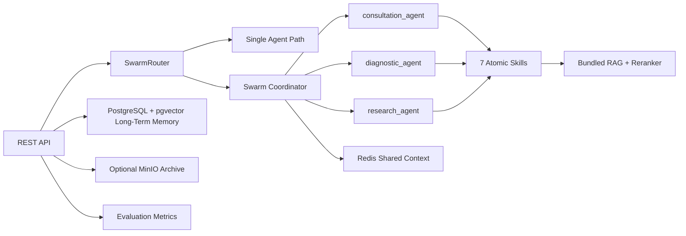

# MediX Java

MediX Java is a Spring Boot medical QA platform that demonstrates a Skills-Agent architecture, Agent Swarm routing, ReAct-style agent loops, short-term and long-term memory, RAG retrieval, and runtime output repair.

## Stack

- Java 21
- Spring Boot 4.1.0
- Spring AI 2.0.0 OpenAI-compatible chat client and pgvector starter
- spring-ai-agent-utils 0.10.0 for progressive skill disclosure
- LangChain4j 1.16.3 data segment model for local RAG chunks
- PostgreSQL + pgvector for long-term memory
- Redis for shared Swarm task context, with local fallback
- MinIO for optional answer archive storage
- Optional local reranker HTTP service

## Architecture



## Implemented Highlights

- 7 atomic skills: knowledge retrieval, risk assessment, symptom analysis, lifestyle advice, ICD-10 reference, clinical guideline, deep research.
- 3 professional agents: health consultation, symptom diagnosis, medical research.
- Agent Swarm routing: simple questions use the single-agent path; complex, high-risk, or evidence-oriented questions fan out with `CompletableFuture`.
- Agent loop: model output chooses `CALL_SKILL:<name>` or `FINAL:<answer>`, with max iteration and max skill-call guards.
- Short-term memory: shared session memory with window reduction and deduplication.
- Memory entropy management: automatic MD5 deduplication, sliding-window compression, entropy estimation, and high-entropy warning logs.
- Long-term memory: conversation summaries persisted to `conversation_summaries` with pgvector embeddings.
- Harness constraints: YAML-bound agent skill boundaries plus Spring AOP runtime validation.
- Output repair: Spring AI `BeanOutputConverter` format support plus automatic disclaimer and urgent-care warning.
- Progressive disclosure: skill docs under `src/main/resources/skills/*/SKILL.md` loaded through `spring-ai-agent-utils`.

## Local Defaults

The default configuration matches the local services described for this workspace:

```yaml
PostgreSQL: jdbc:postgresql://localhost:5432/postgres
Username: postgres
Password: 123456
Redis: localhost:6379
Redis password: 123321
MinIO: http://localhost:9000
Reranker: http://localhost:8081/rerank
```

MinIO is disabled by default. Redis and reranker are enabled in configuration but gracefully fall back when unavailable.

## Run

```bash
mvn test
mvn spring-boot:run
```

Useful environment overrides:

```bash
MEDIX_DB_URL=jdbc:postgresql://localhost:5432/postgres
MEDIX_DB_USERNAME=postgres
MEDIX_DB_PASSWORD=123456
MEDIX_OPENAI_API_KEY=your-key
MEDIX_OPENAI_BASE_URL=https://ark.cn-beijing.volces.com/api/v3
MEDIX_OPENAI_MODEL=doubao-seed-1-6-flash-250828
MEDIX_LIVE_LLM=true
MEDIX_REDIS_ENABLED=true
MEDIX_REDIS_PASSWORD=123321
MEDIX_REDIS_HEALTH_ENABLED=false
MEDIX_REDIS_CONTEXT_TTL=2h
MEDIX_MEMORY_ENTROPY_ENABLED=true
MEDIX_MEMORY_RECENT_MESSAGE_LIMIT=10
MEDIX_MINIO_ENABLED=true
MEDIX_RERANKER_ENABLED=true
```

PostgreSQL needs the `vector` extension available for Flyway migration:

```sql
create extension if not exists vector;
```

## API

Ask a medical question:

```bash
curl -X POST http://localhost:8080/api/v1/chat ^
  -H "Content-Type: application/json" ^
  -d "{\"sessionId\":\"demo-1\",\"question\":\"52岁男性高血压多年，胸痛、呼吸困难，想了解指南证据\",\"context\":{\"age\":52}}"
```

Search bundled knowledge:

```bash
curl "http://localhost:8080/api/v1/knowledge/search?q=胸痛%20呼吸困难&limit=3"
```

List skills and agent boundaries:

```bash
curl http://localhost:8080/api/v1/skills
```

Show evaluation summary:

```bash
curl http://localhost:8080/api/v1/evaluation/summary
```

Show short-term memory entropy for a session:

```bash
curl http://localhost:8080/api/v1/memory/entropy/demo-1
```

## Key Packages

- `com.medix.agent`: model gateway, ReAct loop, professional agents.
- `com.medix.skill`: atomic skills, registry, progressive disclosure.
- `com.medix.swarm`: routing, parallel coordinator, Redis-backed shared context.
- `com.medix.rag`: local knowledge base and reranker adapter.
- `com.medix.memory`: short-term reducer and pgvector long-term memory.
- `com.medix.harness`: YAML constraints, AOP guard, output repair.
- `com.medix.api`: REST API.

## Verification

Current smoke coverage:

- Spring context startup
- skill registry and all 7 skills
- short-term memory reducer
- output repair
- router and Swarm coordinator
- real HTTP smoke tests for `/api/v1/chat` and `/api/v1/skills`
- memory entropy manager, short-term memory auto-clean, Redis TTL, and `/api/v1/memory/entropy/{sessionId}`

Run all tests:

```bash
mvn test
```
